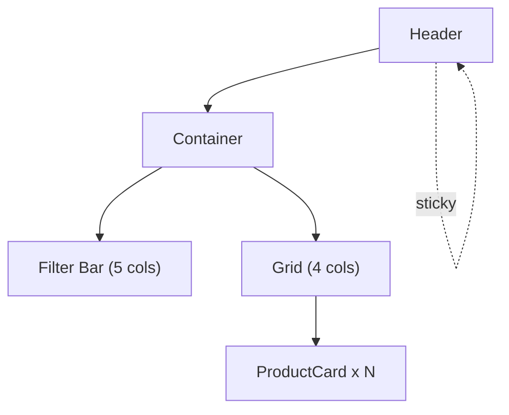
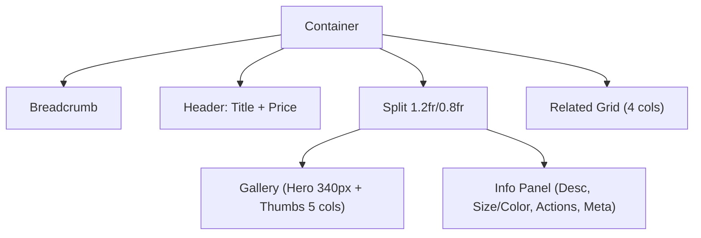
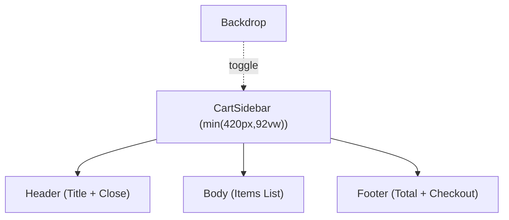

# OceanKicks Frontend — Figma-Style Design Handoff Pack

## Overview

This document provides a designer-friendly handoff that mirrors the implemented React UI in shoes_business_frontend. It includes page-level frames, component callouts, redlines for spacing and grid, typography and color tokens, asset export guidance, interaction notes, and a suggested Figma structure. All specifications are derived from the current codebase and styles so that the frames can be accurately recreated or imported into Figma.

## Pages (Frames)

### Catalog (Home)

The Catalog page presents a filter toolbar followed by a responsive product grid.

- Header: Sticky site header with brand, primary nav, search (desktop) and cart button.
- Filter Bar: Search, Category, Size, Sort, and Reset controls arranged on a responsive grid.
- Product Grid: Cards in a 4-column layout on desktop that collapse at defined breakpoints.
- Footer: Brand, quick links, and copyright.

Redlines and layout notes:
- Container width: min(1100px, 100% - 4vw) per .container.
- Grid columns:
  - ≥ 1024px: 4 columns (grid-4)
  - < 1024px: 3 columns (grid-4 media override)
  - < 900px: 2 columns
  - < 520px: 1 column
- Grid gap: 16px (var(--space-4)) for utilities; default theme grid uses 1rem in theme.css; for consistency in Figma, set 16px base gap on utilities grid frames and annotate that product grid in theme.css uses 16px (~1rem) as practical.
- Filter row columns:
  - Default: 5 columns
  - < 1100px: 4 columns
  - < 900px: 2 columns
  - < 520px: 1 column
- ProductCard:
  - Card radius: 12px (var(--radius))
  - Card media height: 160px
  - Card padding: 0.8rem 0.95rem (~13px 15px)
  - Price color: var(--color-primary)
  - Badge: pill with border-radius: 999px, size smaller caption (0.8rem)

Accessibility:
- Header includes ARIA labels for brand link and nav.
- Filter inputs and controls include labels and aria-labels.
- Empty state uses role="status" and aria-live.

### Product Detail

The Product Detail page shows a left image gallery and right product info panel, with selectable size and color options and related products below.

- Breadcrumb: simple row with separators.
- Title + Price: page title and price to the right on desktop.
- Image Gallery: Hero area and thumbnails.
- Info Panel: Description, SizeSelector, ColorSelector, validation errors, actions, and product meta.
- Related products grid below.

Redlines and layout notes:
- Split grid: 1.2fr / 0.8fr (.pd-wrap)
- Gallery:
  - Hero media height: 340px
  - Thumbs: 5 columns, gap 8px (~.5rem), thumbnail height 56px
  - Active thumb outline: 2px solid var(--color-primary)
- Chips (Size/Color):
  - Border radius 999px, padding ~0.55rem 0.75rem
  - Active: background rgba(37,99,235,.1), no border (transparent)
- Buttons:
  - Primary: Ocean blue, white text
  - Ghost: Transparent background, border color var(--border)
- Validation:
  - Error box background: #FEF2F2, border: #FECACA, color: var(--color-error)

Responsiveness:
- Below 900px, the split collapses to a single column.
- Thumbs reduce to 4 columns at < 900px.

### Cart

The Cart page shows a list of cart items and a summary panel on the right.

- Split grid: 1.2fr / 0.8fr (.cart-page)
- CartItem lines include thumbnail, meta (name, size/color), qty controls and remove button.
- Summary card shows Subtotal, description, CTA to Proceed to Checkout and Continue Shopping.

Redlines and layout notes:
- Cart line item grid columns: 80px thumbnail, 1fr meta, auto qty, auto remove.
- Qty input width: 64px; buttons are ghost variant.
- Cards maintain 12px radius and theme shadows.

Responsiveness:
- Below 900px, split becomes a single column; the cart line reduces to 70px thumbnail + meta + qty per theme adjustments.

### Checkout

A left column with the CheckoutForm and a right column with OrderSummary.

- Split grid: 1.2fr / 0.8fr
- Form uses two-column grid that collapses on small screens.
- Validation states and live region for errors (aria-live).

Redlines and layout notes:
- Form grid:
  - Default: 2 columns with 0.75rem (~12px) gap
  - .form-col-span fields span both columns
  - Inputs border radius 8px (var(--radius-sm))
  - Error input border color: #FCA5A5; background: #FEF2F2
- OrderSummary:
  - Contains item lines and summary rows with price alignment
  - Uses muted text for lesser emphasis

Responsiveness:
- Below 900px, split becomes single column and form grid becomes single column.

### Order Confirmation

A simple centered card with title, optional order ID summary, and links back to home or cart.

Redlines and layout notes:
- Card uses standard surface and padding
- Title and body use base text styles; price styles not used here
- CTA buttons follow standard primary and ghost

### Not Found (optional)

A simple 404 card with title, description, and back link using a primary button.

## Components

### Header

- Structure: brand link, mobile nav toggle visible below 900px, nav links (Home, Cart, Checkout), search input (desktop only), cart button with badge.
- Behavior:
  - Mobile nav toggles via .mobile-toggle; .nav gains .is-open and becomes a vertical menu overlay under header at small screens.
  - Cart button toggles CartSidebar and announces item count via aria-live.
- Key dimensions:
  - Header padding: .75rem vertical
  - Brand logo font-size: 1.25rem
  - Nav link padding: .5rem .75rem; border-radius: 8px
- Shadows and borders:
  - Bottom border: var(--border)
  - Shadow: var(--shadow-sm)

### ProductCard

- Title, optional Badge (secondary tone by default), meta row (category and size), price row.
- Media height: 160px, gradient background via --gradient.
- Card hover elevates to --shadow-md and translates up 2px.

### CartSidebar

- Slide-in panel fixed to the right.
- Width: min(420px, 92vw)
- Grid rows: header, body, footer
- Backdrop: rgba(17,24,39,.4), toggled with .backdrop.show
- Accessibility:
  - role="dialog" with aria-modal
  - Focus trap on Tab and Shift+Tab; return focus to last opener on close
  - Close on Escape
- Footer shows Total and a Checkout button; aria-disabled when no items.

### CheckoutForm

- Fields: name, phone, address (textarea), delivery (select)
- Validation:
  - Live region (#checkout-errors) aria-live="assertive"
  - Error messages using role="alert"
  - Invalid inputs set aria-invalid and aria-describedby
- Actions: primary Place Order; ghost Back to Catalog

### CartItem

- Line item with qty controls and remove
- Thumbnail: 80px square (70px on small screens)
- Price uses primary color

### Common components

- Button:
  - Variants: primary, secondary, ghost
  - Sizes: sm, md, lg
  - Primary: bg var(--color-primary), white text; secondary: var(--color-secondary)
  - Rounding: var(--radius-sm) 8px
- Badge:
  - Tones: primary, secondary, neutral
  - Pill with border 1px var(--border) unless filled
- Loader:
  - Spinner with border and borderTopColor set to primary; sizes: 18, 28, 40
- ErrorState:
  - Card with title in var(--color-error), optional Retry

## Redlines, Grid, and Spacing

### Spacing Scale (CSS variables in layout.css)

- 0, 4, 8, 12, 16, 20, 24, 32, 40, 48 px represented by:
  - --space-0, --space-1, --space-2, --space-3, --space-4, --space-5, --space-6, --space-8, --space-10, --space-12

Apply spacing consistently for gaps and padding in Figma components and frames.

### Grid System

- Product catalog grid:
  - Desktop: 4 columns, gap ~16px
  - Tablet: 3 columns (<1024px)
  - Phablet: 2 columns (<900px)
  - Mobile: 1 column (<520px)
- Split layouts:
  - .split and .checkout-wrap use 1.2fr / 0.8fr, collapse to 1fr under 900px
- Filter bar:
  - 5 → 4 → 2 → 1 columns with the same breakpoints described above

### Breakpoints

- --bp-sm: 480px
- --bp-md: 768px
- --bp-lg: 1024px
- Primary collapse logic used in code occurs around 900px and 1024px, with a single-column fallback at 520px for product grids.

### Border Radius and Shadows

- Radius: var(--radius) = 12px for cards; var(--radius-sm) = 8px for buttons/inputs
- Shadows:
  - --shadow-sm: 0 1px 2px rgba(0,0,0,0.06)
  - --shadow-md: 0 4px 12px rgba(0,0,0,0.08)

## Typography

While no explicit font-family overrides beyond system stack are defined, the UI uses consistent title, subtitle, and description roles:

- Base stack: -apple-system, BlinkMacSystemFont, Segoe UI, Roboto, Oxygen, Ubuntu, Cantarell, Fira Sans, Droid Sans, Helvetica Neue, sans-serif
- Title (.title): color var(--text), margin .25rem 0 .5rem; suggested Figma style:
  - H1: 28–32px, weight 700, color #111827
  - H2/H3: step down 24/20px, weight 600
- Description (.description): muted color var(--muted), default body size (14–16px)
- Price (.price / .price-lg): primary color; larger size variant at ~24px
- Form labels (.form-label, .pd-label): .9rem (~14–15px), muted

Suggested Figma text styles:
- Display: 36–40px / 44–48px line height, 700
- H1: 32px / 40px, 700
- H2: 24px / 32px, 600
- H3: 20px / 28px, 600
- Body: 16px / 24px, 400–500
- Caption: 12–14px / 18–20px, 400; muted color

## Color and Effect Tokens (Ocean Professional)

From src/styles/theme.css:

- Colors
  - --color-primary: #2563EB
  - --color-secondary: #F59E0B
  - --color-error: #EF4444
  - --bg: #f9fafb
  - --surface: #ffffff
  - --text: #111827
  - --muted: #6b7280
  - --border: #e5e7eb
  - --gradient: linear-gradient(180deg, rgba(37,99,235,0.08), rgba(249,250,251,0))

- Radii
  - --radius: 12px
  - --radius-sm: 8px

- Shadows
  - --shadow-sm: 0 1px 2px rgba(0,0,0,0.06)
  - --shadow-md: 0 4px 12px rgba(0,0,0,0.08)

Create Figma Color Styles for each color token and Effect Styles for shadows.

## Assets and Export Guidance

- SVG (recommended):
  - Logos, icons (e.g., brand icon if replaced by a vector), UI glyphs, badges, simple illustrations.
  - Export at 1x (vector scales in Figma); ensure stroke alignment and shared color styles.
- PNG/JPEG:
  - Product photos, hero images, thumbnails.
  - Recommended sizes:
    - Product Card media: min 320×240px (2x for retina: 640×480)
    - Product Detail hero: 680×340 logical height; provide images at least 1360px wide for 2x
    - Thumbnails: 112×56px at 2x (56px logical, 112px pixel)
- 1x/2x guidance:
  - Provide raster images at 2x for crispness on HiDPI.
  - Maintain aspect ratios to match card and hero containers.
- File naming:
  - product-{id}-hero@2x.jpg
  - product-{id}-thumb-{n}@2x.jpg
  - brand-logo.svg
  - ui-icon-{name}.svg

## Interactions and States

- Header:
  - Nav links: hover state background rgba(37,99,235,0.08), active route gets .active style
  - Mobile: hamburger toggles .nav.is-open under 900px
- Buttons:
  - Hover: slight elevate (translateY -1px), shadow to --shadow-md
  - Disabled: reduced opacity and pointer-events disabled (attribute)
- Inputs:
  - Focus ring: box-shadow 0 0 0 3px rgba(37,99,235,.12), border-color rgba(37,99,235,.4)
  - Invalid (forms): border-color #FCA5A5, background #FEF2F2; error message via role="alert"
- CartSidebar:
  - Slide-in transition: transform .25s ease, width min(420px, 92vw)
  - Backdrop fades: opacity .2s ease
  - Accessibility: focus trap, return focus on close, Escape to dismiss, role="dialog" aria-modal
- Catalog:
  - Loader: centered spinner with accessible aria-live "polite"
  - Error: ErrorState card with retry
  - Empty: status region with description
- Product Detail:
  - Gallery thumbs: hover elevation; active outlined 2px primary
  - Add to Cart requires size and color; validation message appears otherwise

## Suggested Figma Structure

Pages:
- 01 Pages
  - Catalog (desktop, tablet, mobile)
  - Product Detail (desktop, mobile)
  - Cart (desktop, mobile)
  - Checkout (desktop, mobile)
  - Order Confirmation (desktop, mobile)
  - Not Found (optional)
- 02 Components
  - Header
  - Footer
  - ProductCard
  - CartSidebar
  - CartItem
  - CheckoutForm
  - OrderSummary
  - Common: Button, Badge, Loader, ErrorState
- 03 Styles & Tokens
  - Color styles (match CSS variables)
  - Text styles (Display, H1–H6, Body, Caption)
  - Effect styles (Shadows: sm, md)
- 04 Prototypes
  - Flows for add-to-cart, open sidebar, checkout, order confirmation

Component variants to include:
- Button: variant (primary, secondary, ghost) × size (sm, md, lg) × states (default, hover, disabled)
- Badge: tone (primary, secondary, neutral)
- Inputs: default, focus, error
- ProductCard: with/without tag
- CartSidebar: closed/open
- Chips: default/active

## Layout Spec Sheet

- Container
  - Max width: 1100px
  - Padding X: 4vw
- Grids
  - Cards: 4/3/2/1 columns at ≥1024 / <1024 / <900 / <520 px
  - Filter row: 5/4/2/1 columns at default / <1100 / <900 / <520 px
  - Splits: 1.2fr / 0.8fr, collapsing at 900px
- Spacing
  - Common gaps: 12–16px depending on section; use --space-3 (12px) or --space-4 (16px)
- Radii
  - Cards: 12px
  - Buttons/Inputs: 8px
- Shadows
  - sm and md as defined above
- Key dimensions
  - ProductCard media: 160px height
  - Gallery hero: 340px height
  - CartSidebar width: min(420px, 92vw)
  - Qty input width: 64px
  - Header padding: ~12px vertical

## Redline Diagrams (Mermaid)

The following diagrams illustrate simplified structure for select pages and components.

Catalog page (desktop)

Product Detail (desktop)

CartSidebar structure

## How to Recreate in Figma

1. Create color, effect, and text styles based on tokens above.
2. Build grid templates:
   - 4/3/2/1 column responsive frames with 16px gaps
   - Split frame template 1.2fr/0.8fr and a mobile 1fr variant
3. Construct components:
   - Buttons with variants and size props as variants
   - Inputs and validation states
   - ProductCard with optional Badge slot
   - CartSidebar frame with open/closed component property
4. Assemble page frames using the templates and components.
5. Link prototypes for:
   - ProductCard click → Product Detail
   - Add to Cart → Sidebar open
   - Checkout → Order Confirmation

## Appendix: Source References

This spec is derived from the current code and styles:

- Pages and routes:
  - src/pages/Catalog.jsx
  - src/pages/ProductDetail.jsx
  - src/pages/Cart.jsx
  - src/pages/Checkout.jsx
  - src/pages/OrderConfirmation.jsx
  - src/routes/AppRoutes.jsx
- Components:
  - src/components/layout/Header.jsx
  - src/components/layout/CartSidebar.jsx
  - src/components/catalog/ProductCard.jsx
  - src/components/cart/CartItem.jsx
  - src/components/checkout/CheckoutForm.jsx
  - src/components/checkout/OrderSummary.jsx
  - src/components/common/{Button.jsx,Badge.jsx,Loader.jsx,ErrorState.jsx}
- Styles:
  - src/styles/theme.css
  - src/styles/layout.css
  - src/styles/components.css

## Notes

- All dimensions and tokens map directly to variables or rules in the code to keep Figma and implementation synced.
- Use vector assets (SVG) for logos and icons; use 2x raster for imagery.
- Focus, hover, and validation states are explicitly defined; replicate them as variants in Figma components.
