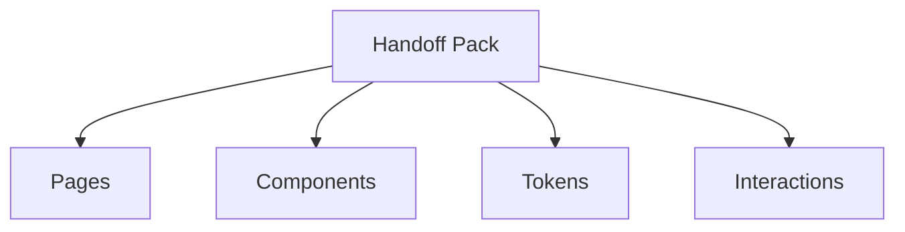

# OceanKicks Figma Handoff

This folder contains the designer handoff pack for the OceanKicks frontend.

- OceanKicks-Figma-Handoff.md: The complete Figma-style handoff document, including page frames, component specifications, redlines, tokens, assets, and interactions.
- Use this as the single source of truth for recreating or importing the implemented UI into Figma. It references the current codebase styles and components to ensure parity.

